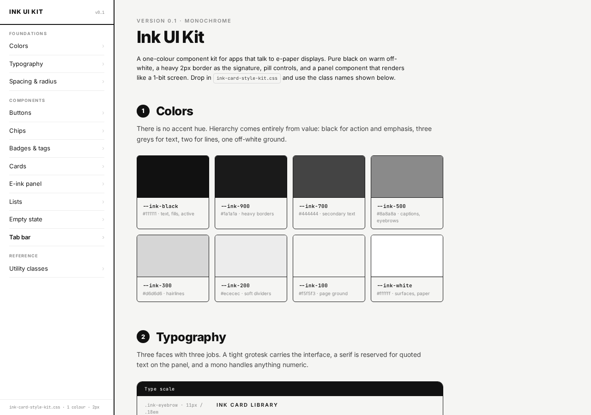

# Ink UI Kit

A one-colour component kit for apps that talk to e-paper displays. Pure black on warm off-white, a heavy 2px border as the signature, pill controls, and a panel component that renders like a 1-bit screen.



## Usage

Drop `ink-card-style-kit.css` into your page and use the class names documented in `index.html`:

```html
<link rel="stylesheet" href="ink-card-style-kit.css">
```

Open `index.html` in a browser to browse the colours, typography, buttons, chips, cards, e-ink panel, lists, empty state, tab bar and utility classes.
